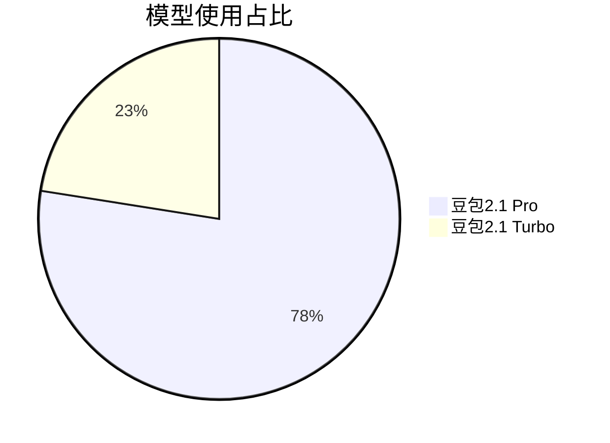
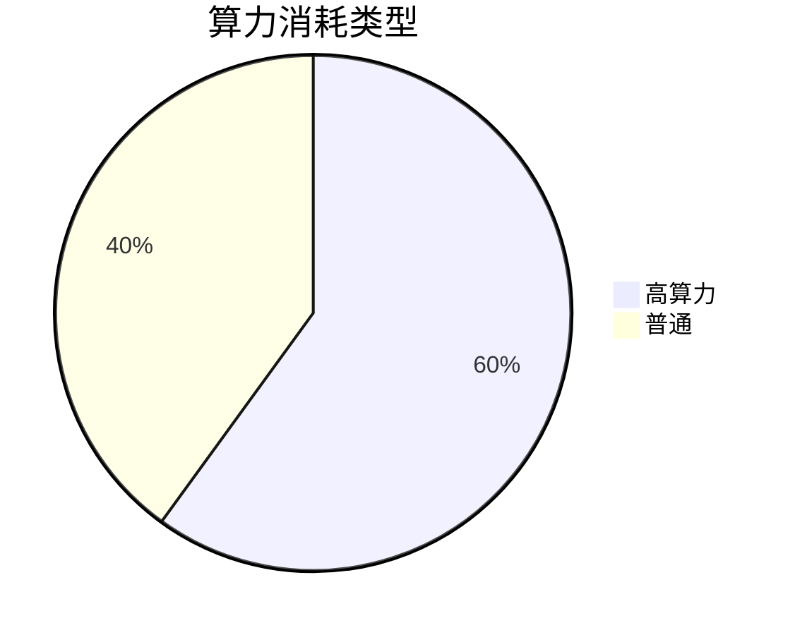
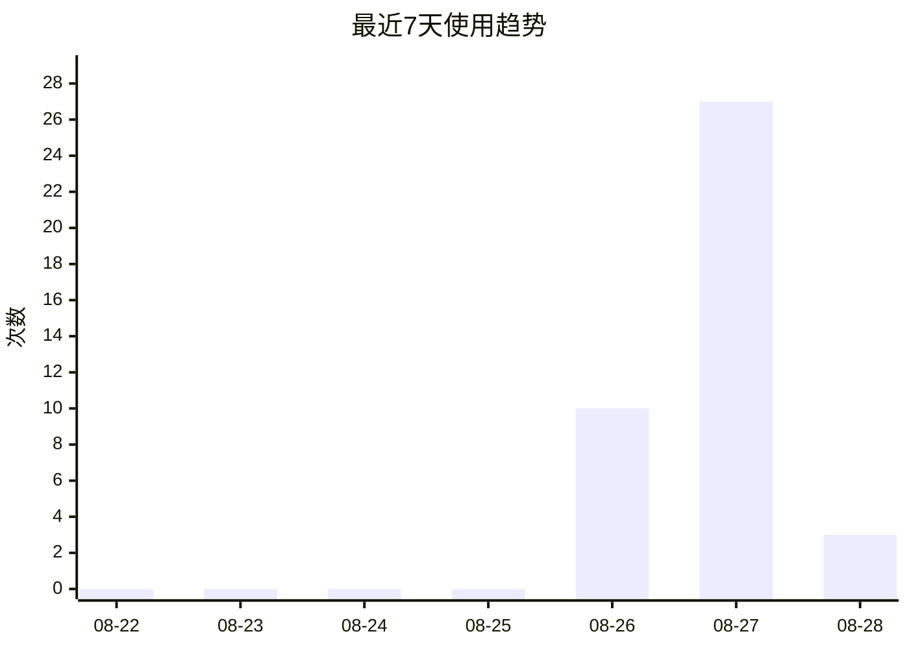

# 模型使用统计

> 自动生成于 2026-08-28 13:12:37 · 九思自动记录 · [完整HTML看板](模型使用统计看板.html)

## 总览

| 总调用 | 今日 | 高算力·5h | 高算力·7天 | 高算力累计 | 预警 |
|:---:|:---:|:---:|:---:|:---:|:---:|
| 40 | 3（高2） | 🟢2/70 | 🟢24/200 | 24（60%） | 🔴 1条 |

> ⚠️ **7天滚动额度是最关键指标**：超过后豆包会锁定高算力功能7天，只能用普通对话。接近80%时请控制使用。

## 阈值预警

- **模型 [豆包2.1 Pro] 今日已用 3/3 次，已达上限!**

## 模型使用占比

## 算力消耗类型

## 最近7天趋势

## 环节分布

| 环节 | 次数 | 占比 |
|---|:---:|:---:|
| 代码开发 | 15 | 38% ███████ |
| 内容创作 | 9 | 22% ████ |
| 办公任务/Agent | 7 | 18% ███ |
| 信息检索 | 4 | 10% ██ |
| 日常对话 | 4 | 10% ██ |
| 知识管理 | 1 | 2%  |

## 模型×环节交叉表

| 模型 | 日常对话 | 内容创作 | 代码开发 | 信息检索 | 办公任务/A | 合计 |
|---|---:|---:|---:|---:|---:|---:|
| 豆包2.1 Pro |  | 8 | 15 |  | 7 | **30** |
| 豆包2.1 Turbo | 4 | 1 |  | 4 |  | **9** |

## 最近记录

| 时间 | 模型 | 环节 | 任务 | 算力 |
|---|---|---|---|---|
| 08-28 13:12 | 豆包2.1 Pro | 代码开发 | 英语开口练v1.1：修复微信TTS多源降级、免费体验门槛（词卡100/ | 🔴高 |
| 08-28 12:40 | 豆包2.1 Pro | 知识管理 | 英语开口练项目文档沉淀：五阶段归档+README+PROJECT_SU | 🔵普 |
| 08-28 08:19 | 豆包2.1 Pro | 代码开发 | 英语开口练app部署上线：Cloudflare Pages+GitHu | 🔴高 |
| 08-27 18:39 | 豆包2.1 Pro | 代码开发 | 英语开口练Web App部署上线：COS存储桶创建+GitHub仓库创 | 🔴高 |
| 08-27 18:17 | 豆包2.1 Pro | 代码开发 | 英语开口练app正式上线：EdgeOne Makers部署(需自定义域 | 🔴高 |
| 08-27 13:33 | 豆包2.1 Pro | 内容创作 | 英语开口练app内容扩充：新增10个场景对话(打车/租房/银行/理发/ | 🔴高 |
| 08-27 13:25 | 豆包2.1 Pro | 代码开发 | 英语开口练app支付修复：将收款码和微信二维码从CDN外链改为base | 🔵普 |
| 08-27 13:18 | 豆包2.1 Pro | 代码开发 | 英语开口练app支付修复：wxp://链接无法在网页唤起微信支付，改为 | 🔵普 |
| 08-27 13:09 | 豆包2.1 Pro | 代码开发 | 英语开口练app支付优化：解码微信收款码获取wxp://支付链接，添加 | 🔵普 |
| 08-27 12:57 | 豆包2.1 Pro | 代码开发 | 英语开口练app优化：二维码点击放大功能（全屏图片查看器+长按识别提示 | 🔵普 |
| 08-27 12:28 | 豆包2.1 Pro | 代码开发 | 英语开口练app上线准备：嵌入微信收款码+好友二维码，清除所有占位符， | 🔵普 |
| 08-27 12:16 | 豆包2.1 Pro | 代码开发 | 英语开口练app价格调整：9.9改为29.9（5处价格引用全部更新） | 🔵普 |
| 08-27 12:07 | 豆包2.1 Pro | 代码开发 | 英语开口练app付费解锁功能：免费额度限制(50词/3对话/5跟读)+ | 🔴高 |
| 08-27 11:36 | 豆包2.1 Pro | 代码开发 | 英语开口练web app开发：单文件HTML应用，6模块（每日挑战/3 | 🔴高 |
| 08-27 11:10 | 豆包2.1 Pro | 办公任务/Agent | 脚本目录恢复：误删后从8-26备份恢复51个文件（7待拍摄+40待发布 | 🔴高 |

## 额度说明

> **当前套餐**：标准套餐（免费体验至9月24日）
>
> **官方额度（以豆包页面为准）**：近7天 2100 额度，当前时段 735 额度
>
> **本工具按调用次数统计**，与官方额度值换算关系：1次高算力≈10额度（粗略估算），次数仅供参考，额度请以豆包官方页面为准。

## 阈值参考（按次数估算）

| 监控维度 | 次数阈值 | 对应官方额度 | 说明 |
|---|:---:|:---:|---|
| 高算力·7天滚动 | 200次 | ≈2100额度 | 超过后锁定7天 |
| 高算力·5小时窗口 | 70次 | ≈735额度 | 滚动窗口限流 |
| 豆包2.1 Pro | 3/日 | 5/5h | 免费版深度思考约3次/日，5h滚动限额 |
| 豆包2.1 Turbo | 无限/日 | -/5h | 普通聊天不消耗高算力额度 |
| 办公任务/Agent | 3/日 | 5/5h | 免费版办公任务约3次/日，单次最长15分钟 |
| 图片生成 | 5/日 | -/5h | 免费版高清图片约5张/日 |
| 视频生成 | 10/日 | -/5h | 免费版视频约10条/日(5秒) |
| 智谱GLM-4-Flash | 无限/日 | -/5h | 免费模型，自动化任务默认 |
| DeepSeek V4 Flash | 无限/日 | -/5h | API按量付费，极便宜 |
| DeepSeek V4 Pro | 无限/日 | -/5h | API按量付费 |

---
*每次记录后自动重新生成 · 数据文件：[usage_data.json](usage_data.json) · 工具脚本：[usage_tracker.py](usage_tracker.py)*