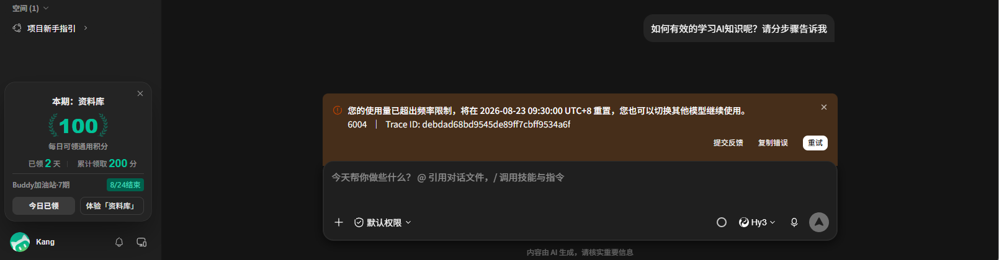

# 用 WorkBuddy 正嗨着，屏幕突然弹了个 429

> 标签：#WorkBuddy ｜ 分类：人工智能 / 办公效率 ｜ 类型：踩坑记录
> 发布平台：腾讯云开发者社区（cloud.tencent.com/developer）

---

今天下午，我正用 WorkBuddy 的 Hy3 干活呢——你猜怎么着？

屏幕突然弹了个错：您的使用量已超出频率限制，将在明天早上 9:30 重置。

我当时第一反应：完了，免费福利被收回了？

第二反应：不会是要收费了吧？

说实话，那一瞬间挺慌的。正干着活呢，突然就干不了了。

后来我查了一圈，才搞明白怎么回事。说句实在的，这事不怪 WorkBuddy，怪我没把「限时免费」这四个字看透。

我跟你说，Hy3 这个模型，WorkBuddy 界面里标着「限时免费」，价格 0.00x——意思是不烧积分。这谁能忍得住？我反正是第一时间就切过去了。

中文理解确实强，写文案、整理文档，又快又稳。我心里还美滋滋：这波免费能薅到月底。

结果用了没两天，就撞墙了。

为什么撞？我查了官方的错误码说明——6004，请求频率受限。说白了就是：你（或者大家）叫得太急，被限流了。开发者实测过，Hy3 的 QPS 上限大概在 10 左右，连续高频猛调就容易撞。

再一查，Hy3 的「限时免费」压根不是无限用：**每人每天有固定免费额度，用光了就触发冷却，等重置窗口到了才恢复。**

你看，免费是营销语言，限制才是工程现实。这个限制界面上没写，等你真撞到墙，才发现免费午餐是有配额的。

不过话说回来，免费期官方已经明确延长到 8 月 31 号了——不是福利被收回，就是限流，到点自己好。

那撞墙了怎么办？我这几天摸出来三个办法：

第一个，等重置。报错里会告诉你什么时候恢复，到点自动好。最省心，但活也停了。

第二个，切模型。WorkBuddy 支持多模型，撞墙立刻切到 DeepSeek-V4-Flash（0.06 倍率），日常任务完全够用，积分还超省。我切过去之后，手头的活一个没耽误。这是我最推荐的。

第三个，错峰。官方建议每晚 23 点到早上 8 点用 Hy3，这个时段资源宽松，不容易撞。高消耗的任务也分批发，别连续猛调。

反正就是——免费的甜点能吃，但别指望它管饱。

还有一句扎心的：限流的时候别狂点重试，你越急它拒得越狠。缓一分钟，或者直接切模型，都比干等强。

你平时用 WorkBuddy 撞过 429 吗？评论区说说，我赌你不是第一个。🎵
