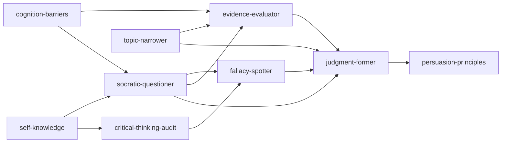

# INDEX · 超越感觉 skill 工具包

> 阶段3 产物 · 《超越感觉》第8版 · 2026-08-22
> 9 个 skill 总览 + 引用图

## Skill 总览

| # | skill | 一句话 | 触发时机 |
|:--|:--|:--|:--|
| 1 | fallacy-spotter | 25 种谬误识别与应对 | 争论/审稿/自查逻辑漏洞 |
| 2 | critical-thinking-audit | 14 问思维自查 | 想盘思维弱点/反复栽跟头 |
| 3 | evidence-evaluator | 11 种证据×提问 | 判断"研究说/专家说"可信度 |
| 4 | judgment-former | 形成平衡精确的判断 | 表态/下结论/写判断句 |
| 5 | socratic-questioner | 四层探索性提问 | 检验想法/方案/决策前自查 |
| 6 | persuasion-principles | 说服 11 原则 | 说服他人/写提案/回应质疑 |
| 7 | topic-narrower | 少即是多限定议题 | 选题太大/研究不知从哪下手 |
| 8 | self-knowledge | 四重塑造→成为个体 | 想弄清"多少真是我的" |
| 9 | cognition-barriers | 五重认知障碍提醒 | 对"我知道"过度自信时 |

## 引用图



## 使用顺序建议（决策场景）

```
self-knowledge → topic-narrower → socratic-questioner
  → evidence-evaluator → fallacy-spotter → judgment-former
  → persuasion-principles
```

## 相关链接

- 全书骨架：`../BOOK_OVERVIEW.md`
- 三重验证记录：`../verified.md`
- 术语词典：`./GLOSSARY.md`
